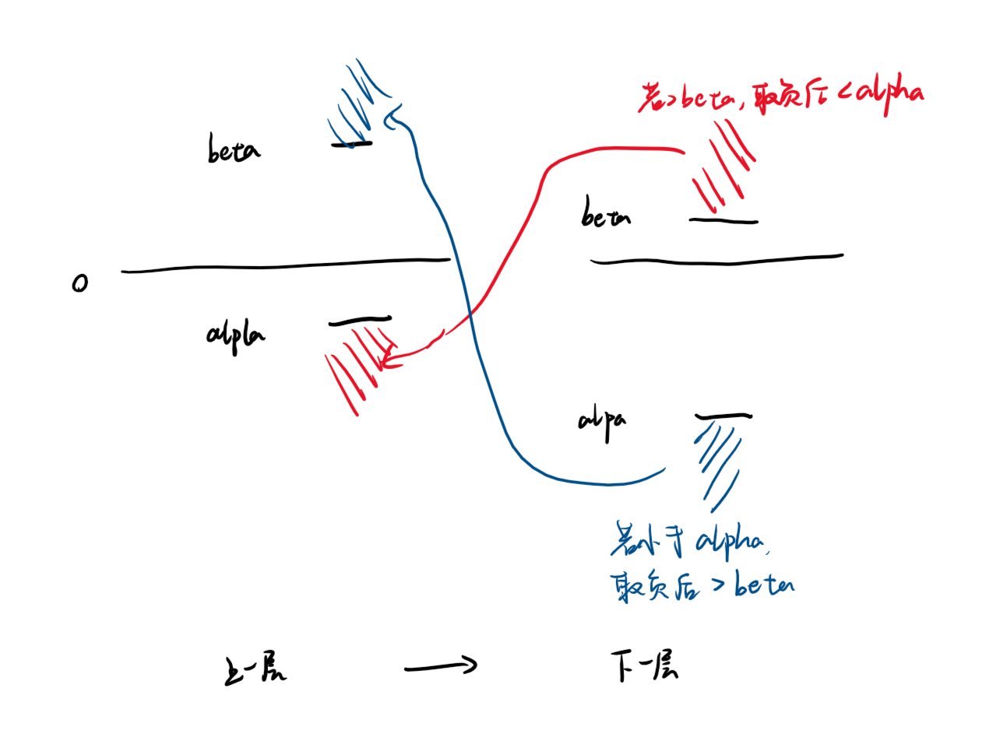
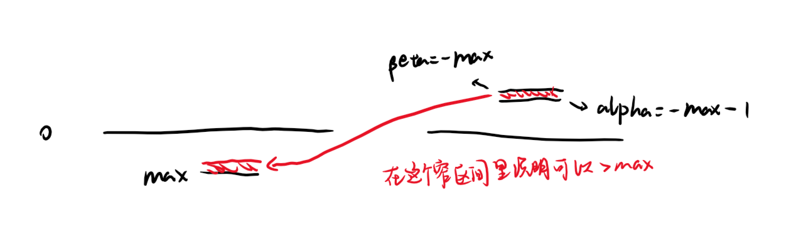
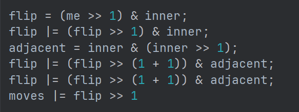
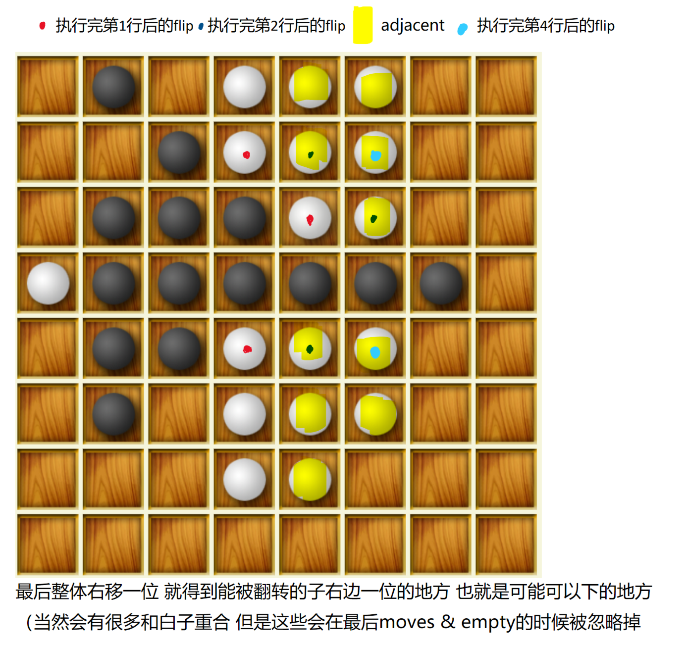

- 写这个东西的目的是为了给之后的看到大作业完全摸不着头脑的同学一点启发或者说教程
- 榜一的strongbwcore的仓库给了我很多启发 https://github.com/fffasttime/Reversi-bwcore/blob/master/doc/bwcore_TODO.md 我也希望我的东西能给后人一点帮助
- 下一次大作业轮到黑白棋应该是三四年之后了 不过搜索算法比如说minimax，alpha-beta剪枝以及试探搜索，PVS之类的东西都是通用的，评分函数确实有很大差别，不过用位棋盘提高性能的思路也是通用的
- 最重要的东西还是搜索的能力 如果愿意搜的话 其实能找到很多很不错的资料的 在这里列举一些
> 中文的：http://www.heibaiqi123.com/jiaocheng/3/ 里面对各种剪枝、提高搜索效率的方法介绍的很详细 
>   英文的 其实随便搜一下就有很多 https://courses.cs.washington.edu/courses/cse573/04au/Project/mini1/RUSSIA/Final_Paper.pdf 这个是我评分函数想法的主要依据
>   然后是两个研究黑白棋ai最古早也是最重要的两个人 zebra的作者http://radagast.se/othello/index.html 以及写了很多关于黑白棋的论文的 logistello的作者Michael Buro的主页 https://skatgame.net/mburo/ 

- 然后大概介绍一下我的代码 main.cpp里是io部分 ai.h里是搜索算法 board.h里是评分函数和一些棋盘操作比如说寻找可行位置和落子 我已经比较详细地加上了注释
- 首先讲一下搜索算法 基本的思路就是mini-max，或者说是negamax，这个思路其实很符合直觉，就是每一步都有很多种下法，我们一定是从中挑选一步得分最高的来下，而这步的得分怎么确定呢？ 就是下完这步之后，对手也有很多种下法，对手的所有下法里得分的最大值就是下完这步之后对手的得分，由于这是一个零和游戏，相当于我们的得分就是对手的得分取负，所以说可以用一个递归函数一直搜索下去 这样这个搜索树会很大 所以我们限制一下搜索层数 到达这个指定层数之后就不继续往下搜索了 而是调用评分函数来计算出这个局面的得分 （由此可以看出 评分函数不仅应该包含对于当前这个局面好坏的评价 更应该能够包含这个局面对于未来走向的影响 因为评分函数实际上是因为搜不到底而采用的一种取舍 它实际上是对于最终结果的预测）
- 如果仅仅只是这样搜索的话，搜索树很快就会变得非常大，就会导致搜不了几层 所以我们需要进行一些剪枝。最简单的剪枝就是alpha-beta剪枝，就是说比如我这一层已经搜到了至少能得到m分，那么如果我的下一层搜到了能得到一个大于-m的分数，那么相当于我这层的得分就会小于m，那么我就一定不会采取这个能让下一层搜到大于-m的数的走法，所以这个枝就已经可以被剪掉了。也就是说，这一层已经搜到的最大值（用alpha来表示），取负之后就是下一层能够允许的最大值（用beta）来表示，如果超过就应该被剪掉。所以我们调用搜索下一层函数的时候，下一层的beta应该等于-这一层的alpha，下一层的alpha应该等于这一层的-beta，用图示来表示就是这样的 
- alpha-beta剪枝似乎已经能让搜索深度增加不少了。但是还不够，还可以继续优化。如果评分函数比较准确的话，浅层的搜索已经可以比较准确的代表某一步的分数了，这个时候先迅速地执行一次浅层搜索，之后根据搜索结果进行排序，然后再进行深层搜索，先搜得分高的，这样alpha就会提高，然后搜得分低的，很可能就会低于alpha，就会被剪枝剪掉，这样能够进一步地提高搜索效率
- 更进一步地，在正式搜索每一步之前，先执行一次上界为alpha+1，下界为alpha的零宽搜索（由于宽度很小，能剪掉很多枝，因此搜索速度会很快），如果搜索结果>alpha再执行正式搜索，是不是就能搜的更快了？用图示来表示就是这样的 
- 到这里我采用的所有优化搜索的方法就说完了，可以看出其实是非常简单的，也就是说其实还是有很大优化空间的。但是即使是这样，我的ai仍然达到了一个比较高的水平，因为实际上搜索深度并没有那么的重要，真正的核心仍然是你的评分函数，如果你的评分函数能做到完美地预测结果，那么根本不搜索也没关系。如果你的评分函数非常不准，那么搜的再深也没有用
- 注：由于botzone上的clock()函数似乎执行的过于缓慢，所以建议采用多线程卡时的方法，就是用一个单独的线程来调用搜索函数，然后主线程沉睡950s之后让搜索函数停止执行，这样真的能快上不少（我的bot改成这样之后从1700分提高到了1900分

- 然后讲一讲位棋盘 使用一个8*8数组来存储棋盘的方法固然很方便也很符合直觉，但这样会导致不管是寻找可行位置还是在搜索过程中复制棋盘的速度都过于缓慢，为了提高性能，较强的ai往往采用位棋盘的方式存储，用位运算来进行寻找可行位置等等操作
- 具体方式就是分别用一个unsigned long long来表示黑棋和白棋
- 然后以寻找可行位置为例来说明应该怎样进行位运算操作
-  
  以右移为例 看图应该能明白
  这部分代码是从strongbwcore那里借鉴的，那位同学说他是从zebra那里借鉴的
  adjacent的存在是为了减少位运算的数量，不然每个方向都要进行7次移位操作 现在能减少到5次

- 我要说的大概就是这些了，如果想有更深入的研究的话，强烈建议去看一下Buro的论文，尤其是 https://skatgame.net/mburo/ps/improve.pdf 现代的黑白棋ai主要使用的估值方式是模板估值，而这篇就是模板估值的开山之作（在2000年就用梯度下降的方法来拟合，我还是觉得挺震撼的）
- 然后关于用神经网络来做估值函数，可以看看 https://lapagedolivier.fr/neurone.htm 我还是受了他很多的启发的，虽然最后网络训练的不是很成功，但算是入了门吧
- 如果想训练网络的话，buro有开源他的logistello的对局数据，然后应该是现在最强的黑白棋ai egaroucid 也有开源对局数据 可以去他们网站上搜 加起来应该是有几十万局的 btw egaroucid的优化做的真的非常好，能把我的cpu吃满，中局情况数最多的情况下也可以几秒就搜22层，结果也非常准确，可以利用这个来帮助调参
- 最后说一下，黑白棋算是很古老、很经典、也很适合电脑来下的一种棋，看黑白棋ai的发展史有一种看cs发展史的感觉，真的很令人感慨。看FOREST的作者写的东西，意识到神经网络有完全不同的理解方式，我之前只是把它当作对于人脑的一种非常简化的模拟，然而它也可以非常数学的理解，比如一层（带激活函数的）神经元就已经可以看作一个万能的函数模拟器了